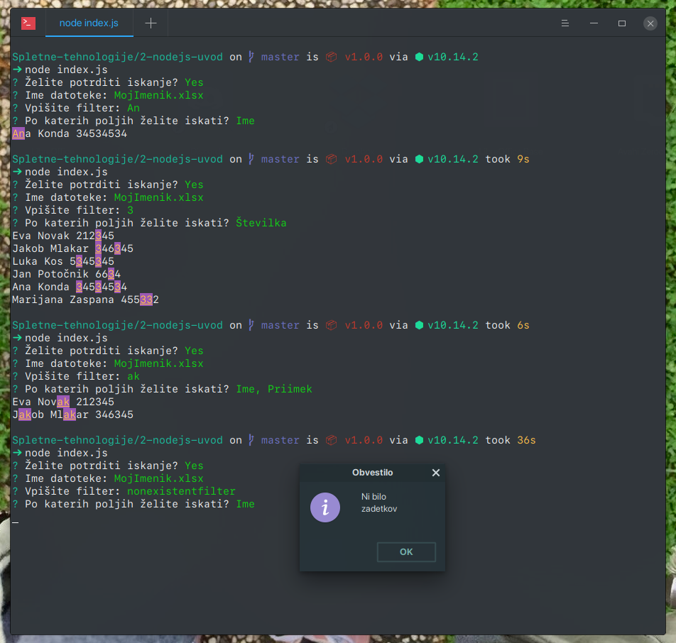

# Node.js uvod

S pomočjo interpreterja Node.js ustvarite konzolno aplikacijo za iskanje ljudi po imeniku. 

## Podrobnejši opis
Imenik je shranjen v formatu xlsx in je priložen k nalogi. Uporabnik lahko pri zagonu aplikacije poda ime datoteke. Če tega ne stori ga mora aplikacija po imenu datoteke vprašati (Privzeta vrednost naj bo MojImenik.xlsx). Aplikacija na začetku uporabnika vpraša, če želi opraviti iskanje (Privzeta vrednost naj bo false). V primeru da vpiše y, ga aplikacija vpraša po filtru in po katerih poljih želi iskati, v nasprotnem primeru se aplikacija zaključi. Pri izpisu rezultatov najdene podnize oblikujte drugače od ostalega besedila (druga barva pisave, ozadja, podčrtano ...). V primeru, da zadetka ni, se uporabniku odpre pogovorno okno, ki ga o tem obvesti.

Uporabite naslednje pakete (`npm init` in `npm install`):
- [commander](https://github.com/tj/commander.js/)
- [inquirer](https://github.com/SBoudrias/Inquirer.js/)
- [chalk](https://github.com/chalk/chalk)
- [dialog](https://github.com/tomas/dialog)
- [js-xlsx](https://github.com/SheetJS/js-xlsx)

Aplikacijo namestite tako, da se bo lahko globalno pognala iz terminala.

V [package.json](package.json) dodajte:
```json
"bin": {
    "mojimenik": "./index.js"
},
```

na vrhu programa nastavite node za interpreter 
```js
#!/usr/bin/env node
```
in nato namestite z ukazom 
```bash
npm install -g
```

## Screenshot rešitve


