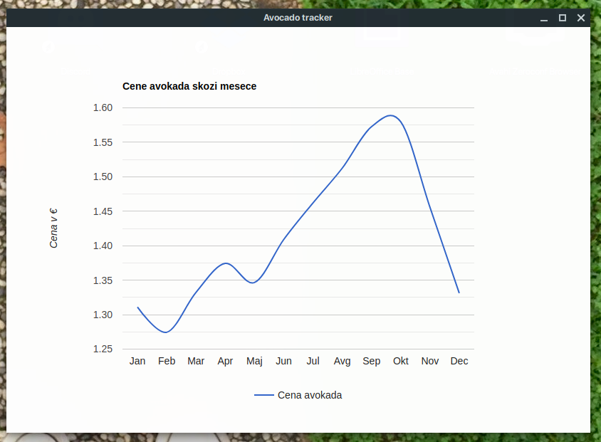

# NWjs in Webpack 2018/2019

Ustvarili boste namizno aplikacijo z NWjs. Izrisati morate graf, ki prikazuje gibanje cene avokada skozi mesece. Za grafe uporabite eno od knjižnic [Google Charts](https://www.npmjs.com/package/google-charts) ali [D3](https://www.npmjs.com/package/d3). Za branje datoteke lahko uporabite [CSVtoJSON](https://www.npmjs.com/package/csvtojson).

## Podrobnejši opis

[NWjs](https://nwjs.io/) razpakirajte v mapo NWjs. V tej mapi bo [Webpack](https://webpack.js.org/) ustvaril mapo dist in tudi skopiral datoteko package.json, ki jo nw.exe potrebuje.

Zraven mape NWjs imejte v projektu še mapo data in src. V mapo data skopirate avocado.csv, v mapi src pa boste ustvarili [index.html](src/index.html) in [index.js](src/index.js), kamor boste implementirali aplikacijo.

Ustvarite dve konfiguracijski datoteki za Webpack: [webpack.config.clean.js](webpack.config.clean) in [webpack.config.prod.js](webpack.config.prod.js).

V datoteki webpack.config.prod.js ustvarite konfiguracijo za Webpack, ki:

+ iz root mape projekta skopira datoteko package.json v mapo NWjs,
+ v mapi NWjs ustvari mapo dist, kamor ustvari končni html in javascript, ki naj bo bundle.js in
+ skopira data/avocado.csv,

V [package.json](package.json) morate pravilno nastaviti atribut main, da bo nw.exe našel html datoteko, npr. 
```json
...
"main": "dist/index.html",
...
```
Pravilno morate nastaviti atribute entry, output, target (target:'node') in plugins.

Uporabite naslednje plugin-e:
- [Clean-Webpack](https://github.com/johnagan/clean-webpack-plugin) za čiščenje ustvarjenih in skopiranih datotek in direktorijev v NWjs,
- [Html-Webpack](https://github.com/jantimon/html-webpack-plugin) za ustvarjanje končnega html dokumenta iz index.html, ki ga uporabite kot template,
- [Copy-Webpack](https://github.com/webpack-contrib/copy-webpack-plugin) za kopiranje datoteke package.json in avocado.csv.

V datoteki webpack.config.clean.js ustvarite konfiguracijo za Webpack, ki samo povrne mapo NWjs v prvotno stanje (pobrišite mapo dist in package.json).

V package.json morate ustvariti 3 scripte:

```json
"clean": "webpack --config webpack.config.clean.js",
"build": "webpack -p --config webpack.config.prod.js",
"start": "npm run build && cd NWjs && nw.exe",
```
ki jih lahko poženete z:
```bash 
npm run <ime skripte>
```

Namestiti morate tudi paketa webpack in webpack-cli.

## Screenshot rešitve

