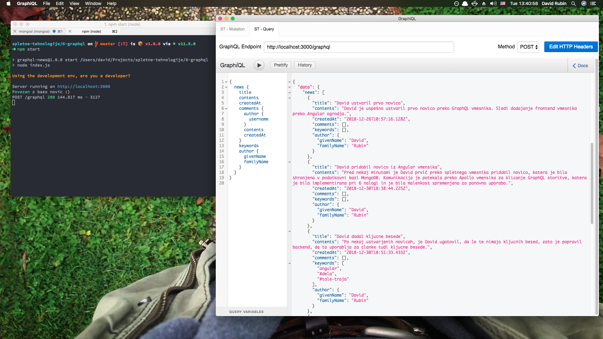

# GraphQL + OAuth 2.0

## Zahteve naloge

Ustvarite GraphQL storitve za novice z identično funkcionalnostjo, kot v prejšnji vaji pri REST storitvah, vključno z avtentikacijo in avtorizacijo.

Prednost GraphQL-a je v tem, da lahko v eni HTTP zahtevi pridobimo več različnih podatkov, za kar bi pri REST storitvah potrebovali več HTTP zahtev.

Preden se lotite naloge, poženite priložen primer [vaja6GraphQLAuth2.zip](vaja6GraphQLAuth2.zip). Uporabniškega vmesnika pri tej nalogi prav tako ne rabite delati. Vso funkcionalnost lahko preizkusite s POSTMAN-om.

Primer poizvedbe iz javascript-a (brskalnika/klient): [https://graphql.org/graphql-js/graphql-clients/].

## Rešitev

Rešitev lahko preverjamo s pomočjo [GraphiQL](https://electronjs.org/apps/graphiql). Pri podani zahtevi brez avtentikacije, nas 
privzet vmesnik (@ localhost:3000/graphql) preusmeri na zastonjskega. V kolikor si pridobimo token (POST na /oauth/token), pa lahko tudi beremo plačljive novice, dodajamo komentarje, urejamo novice, dodajamo uporabnike. Seveda ima vsaka akcija dodatno avtorizacijo.

